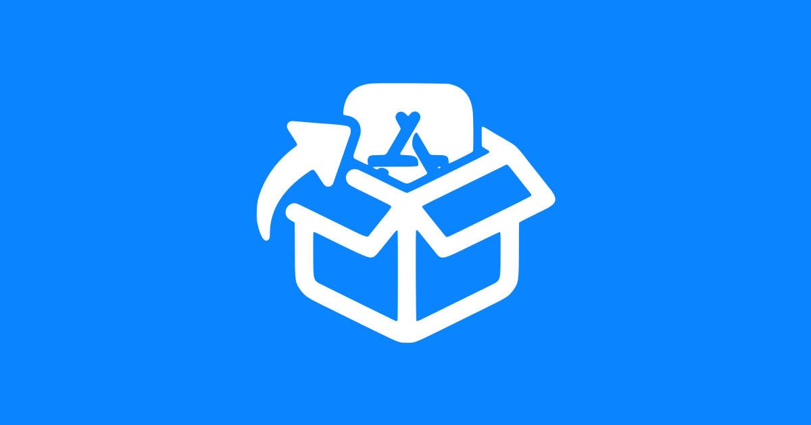

<p align="center">
  
</p>

<h1 align="center">iOS Sideload Source</h1>

<p align="center">
  <a href="https://aiko3993.github.io/iOS-Sideload-Source/">
    
  </a>
</p>

<p align="center">
  A personal, self-updating sideload source for AltStore / SideStore / LiveContainer etc. <br>
  If you want to suggest an app to be added, you can request it in the Issues.
</p>

<p align="center">
  个人维护的自动更新侧载源，适用于 AltStore / SideStore / LiveContainer 等侧载 apps。 <br>
  如果你有想要添加的 app，可以在 Issues 中提出。
</p>

---

## Sources / 软件源

### Standard / 标准源

* **Original (原始版)**
```text
https://raw.githubusercontent.com/Aiko3993/iOS-Sideload-Source/main/sources/standard/original/source.json
```

* **Coexist (共存版)**
```text
https://raw.githubusercontent.com/Aiko3993/iOS-Sideload-Source/main/sources/standard/coexist/source.json
```

<details>
<summary><b>NSFW Sources / NSFW 软件源 (Click to expand / 点击展开)</b></summary>
<br>

* **Original (原始版)**
```text
https://raw.githubusercontent.com/Aiko3993/iOS-Sideload-Source/main/sources/nsfw/original/source.json
```

* **Coexist (共存版)**
```text
https://raw.githubusercontent.com/Aiko3993/iOS-Sideload-Source/main/sources/nsfw/coexist/source.json
```
</details>

---

## Links / 相关链接

- [Web Interface / 网页界面](https://aiko3993.github.io/iOS-Sideload-Source/)
- [Supported Apps / 支持的应用列表](.github/APPS.md)

## Disclaimer / 免责声明

This repository serves as a mirror and index. App copyrights belong to their respective authors. Assess risks before sideloading.

本仓库仅作搬运与索引，应用版权归原作者所有。请在侧载前自行评估安全风险。
